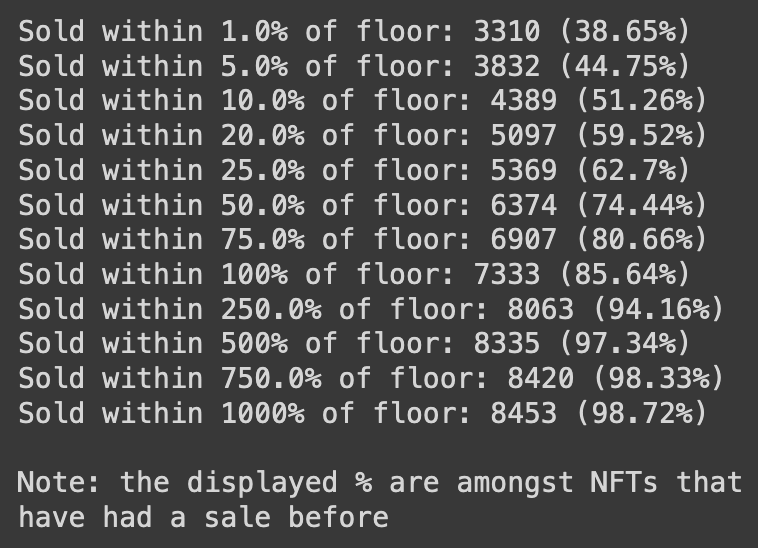
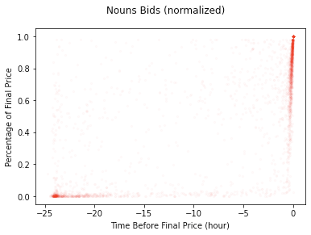
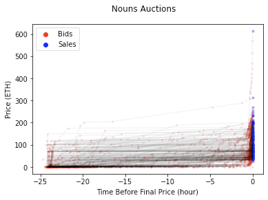
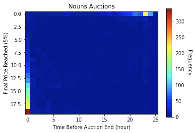
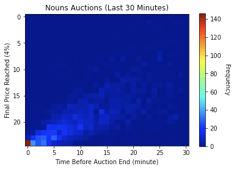

# misc-notebooks
## [how-many-nfts-are-floor]((https://github.com/fiveoutofnine/misc-notebooks/tree/main/how-many-nfts-are-floor))
[<ins>__`Tweet`__</ins>](https://twitter.com/fiveoutofnine/status/1498829392021237762?s=20&t=Td5bGCMdlnmiIg1_bUcSvw)

How many NFTs are considered "floor" NFTs in a collection?

I computed `sale_price / floor_at_sale` for BAYC:
38.32% of apes have sold within 5% of the floor before.

A collection's floor is currently way too dominant as a pricing reference, and this shouldn't be the case.

<table>
  <tr>
    <td></td>
    <td></td>
  </tr>
 </table>

## [nouns-bids](https://github.com/fiveoutofnine/misc-notebooks/tree/main/how-many-nfts-are-floor)
[<ins>__`Tweet`__</ins>](https://github.com/fiveoutofnine/misc-notebooks/tree/main/nouns-bids)

I wanted to confirm the myth that auctions’ bids are actually mostly at the start/end, so I visualized @nounsdao
 auctions’ bids

Even though it was kinda expected, I’m pretty surprised how much action takes place in the last 4 mins

<table>
  <tr>
    <td></td>
    <td></td>
  </tr>
  <tr>
    <td></td>
    <td></td>
  </tr>
 </table>
